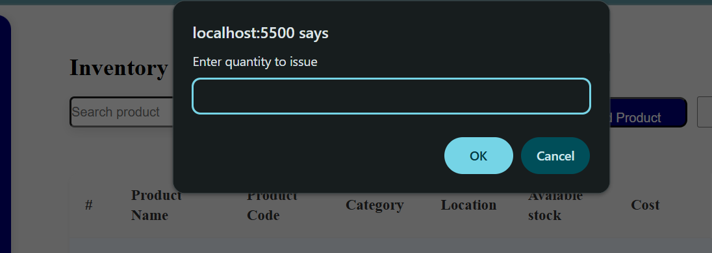

# Product-inventory-manager

# 🗂️ Product Inventory Manager (PIM)

A simple yet powerful **Inventory Management System** for tracking product categories, quantities, stock updates, and warehouse assignments. Built with **HTML, CSS, and JavaScript**, this dashboard-style application allows users to manage stock operations like issuing and receiving products efficiently.

---

## 📌 Project Overview

The **Product Inventory Manager (PIM)** is designed to help businesses, small warehouses, or administrative staff manage inventory across various categories. The goal was to create a minimal, responsive, and fully functional inventory interface with CRUD features and intuitive stock management tools.

---

## 🎯 MVP Features

✅ Dashboard View with Table Listing  
✅ Search and Filter Products by Name or Category  
✅ Add New Product (with autogenerated code and category-based location logic)  
✅ Edit and Delete Product Details  
✅ Track Stock Movements: Issue (reduce) and Receive (increase) product quantity  
✅ Logout Functionality with LocalStorage session management  
✅ Responsive UI styled with modern CSS layout principles  

---

## 🚧 Sections Under Development

These sections are planned but commented out due to time constraints. Functionality exists or is partially scaffolded:

- **📦 Categories Section**  
  Add and delete product categories (stored in `localStorage`)

- **🏭 Warehouse Section**  
  Assign warehouse zones based on category logic

- **📊 Stock Overview Section**  
  Visual overview and log of stock movements, including low-stock alerts

---

## 🛠️ Tech Stack

- **Frontend:** HTML5, CSS3, JavaScript (Vanilla)
- **Backend/API Simulation:** JSON Server (`http://localhost:3000/Products`)
- **Icons:** Google Material Icons
- **Storage:** `localStorage` (for login session and categories)

---

## 🚀 Getting Started

1. Clone the repository:
   ```bash
   git clone https://github.com/your-username/pim-manager.git
   ```
2. Navigate into the folder
    cd pim-manager

3. Install and run JSON Server (requires Node.js):  
    npm install -g json-server
    json-server --watch db.json --port 3000
4. Open index.html in a browser.

🔒 Login Page
   A simple login system checks for a stored login session using localStorage. If no session exists, the user is redirected to login.html.

📷 Screenshots (optional)
You can add screenshots here after styling is finalized to showcase:

 Dashboard layout
 

 Add product form

 Stock issuance/receiving in action
 

✨ Future Enhancements

## Backend integration with Node.js or Firebase

## Export to CSV/PDF functionality

## User roles and permissions (admin, staff)

## Stock movement history log

## Responsive mobile-first redesign

🙋‍♀️ Author
Lydia — Frontend Developer & Software Engineering Student
Passionate about building intuitive, functional web apps for real-world use cases.

📄 License
This project is licensed under the MIT License.

 
